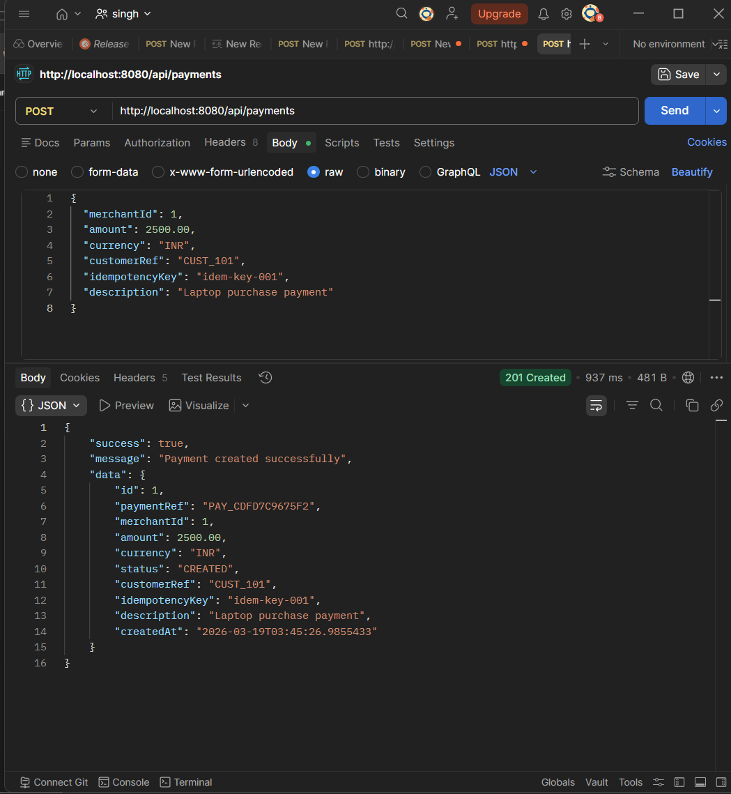
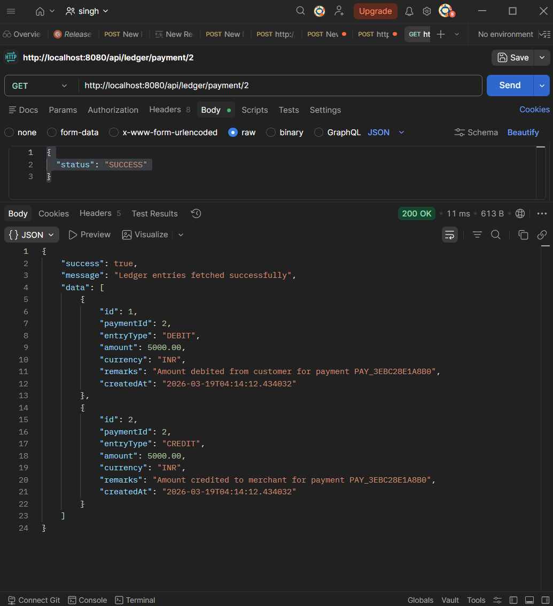
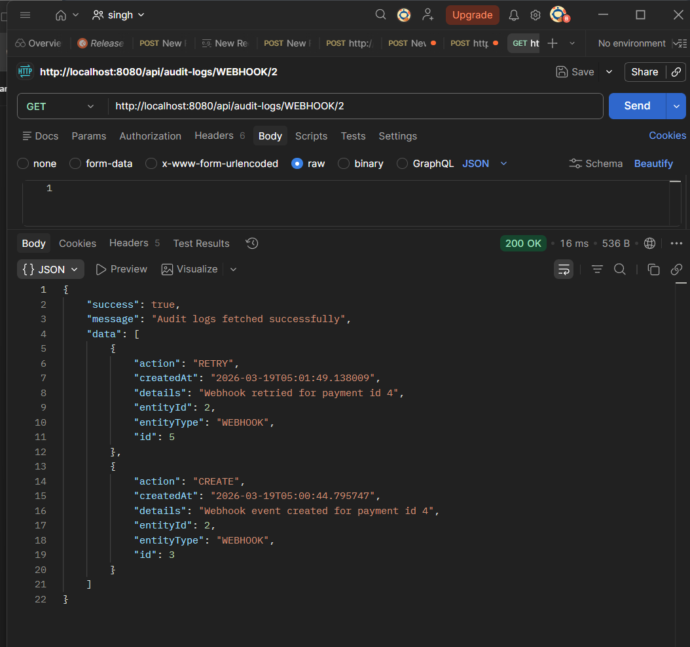

# 💳 Payment Gateway Backend (Spring Boot)

A production-style **Payment Gateway backend system** built using **Java + Spring Boot**, designed to simulate real-world fintech systems with features like idempotent APIs, ledger accounting, webhook handling, retry mechanisms, and audit logging.

---

## 🚀 Features

### ✅ Merchant Management

* Create and manage merchants
* Unique merchant identification

### ✅ Payment Processing

* Create payments with unique `paymentRef`
* Supports status lifecycle:

    * `CREATED → PROCESSING → SUCCESS / FAILED`

### ✅ Idempotency Support

* Prevents duplicate payment creation using `idempotencyKey`
* Ensures safe retries (critical in real payment systems)

### ✅ Ledger System (Double Entry Accounting)

* Automatically creates:

    * **DEBIT entry** (customer)
    * **CREDIT entry** (merchant)
* Ensures financial consistency

### ✅ Webhook System

* Sends payment status updates to merchant systems
* Stores webhook events with payload

### ✅ Webhook Retry Mechanism

* Failed webhook deliveries can be retried
* Tracks:

    * retry count
    * delivery status (`PENDING`, `FAILED`, `SENT`)

### ✅ Audit Logging

* Tracks all critical actions:

    * Payment creation
    * Status updates
    * Webhook creation & retry
* Improves observability & debugging

---

## 🛠 Tech Stack

* Java 17
* Spring Boot
* Spring Data JPA
* MySQL / PostgreSQL
* Maven
* REST APIs

---

## 📂 Project Structure

```
controller/
service/
service/impl/
repository/
entity/
dto/
enums/
exception/
```

---

## 🔄 Payment Flow

1. Create Payment
2. Update to `PROCESSING`
3. Update to `SUCCESS`
4. System automatically:

    * Creates ledger entries
    * Triggers webhook
    * Stores audit logs
5. Retry webhook if failed

---

## 📡 API Endpoints

### Payment APIs

```
POST   /api/payments
PATCH  /api/payments/{id}/status
GET    /api/payments/{id}
```

### Ledger APIs

```
GET /api/ledger/payment/{paymentId}
```

### Webhook APIs

```
GET  /api/webhooks/payment/{paymentId}
POST /api/webhooks/retry/{webhookId}
```

### Audit Log APIs

```
GET /api/audit-logs/{entityType}/{entityId}
```

---

## 🧪 Sample Request

### Create Payment

```json
{
  "merchantId": 1,
  "amount": 5000,
  "currency": "INR",
  "customerRef": "CUST_101",
  "idempotencyKey": "idem-key-001",
  "description": "Laptop purchase"
}
```

---

## 🧠 Key Concepts Implemented

### 🔹 Idempotency

Ensures same request does not create duplicate payments.

### 🔹 Double Entry Ledger

Every transaction is recorded as:

* Debit (customer)
* Credit (merchant)

### 🔹 Webhooks

Asynchronous communication with external systems.

### 🔹 Retry Mechanism

Handles failures in webhook delivery.

### 🔹 Audit Logging

Tracks system actions for traceability and debugging.

---

## 🎯 Why This Project?

This project demonstrates real-world backend concepts used in:

* Payment gateways (Razorpay, Stripe)
* Banking systems
* Fintech platforms

---

## 🔮 Future Improvements

* Add authentication & authorization (JWT)
* Integrate real webhook delivery (RestTemplate/WebClient)
* Add message queue (Kafka/RabbitMQ)
* Add rate limiting
* Add distributed transactions

---

## 📸 Screenshots

### Payment API


### Ledger


### Webhook


---

## 👨‍💻 Author

**Bhagavan Singh**

---

## ⭐ Support

If you like this project, give it a star ⭐ on GitHub!